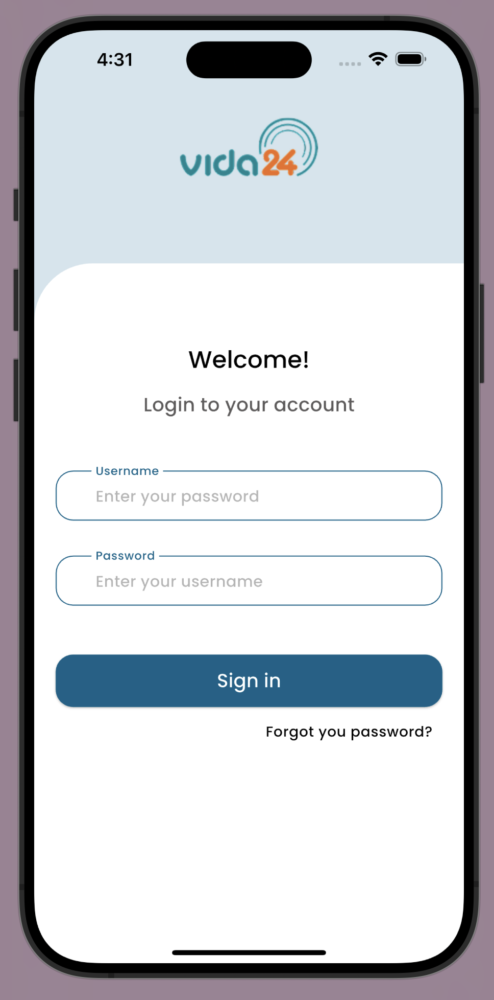
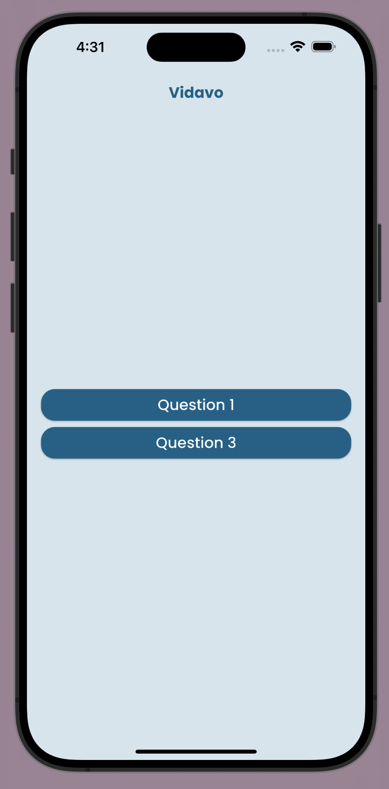
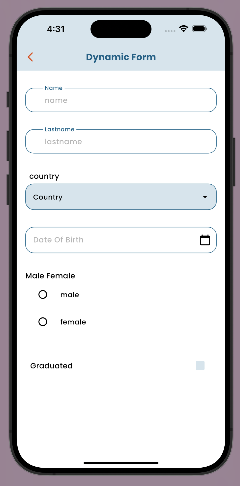
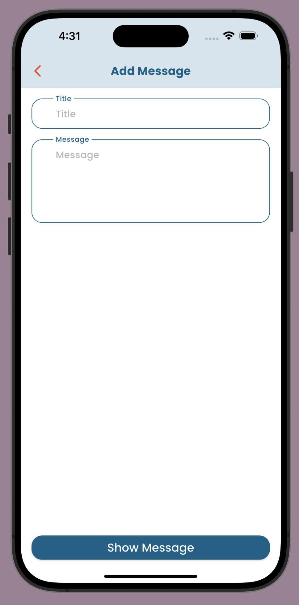

# Vidavo

A Flutter test project

## Getting Started

This project demonstrates:
- A **dynamic form system** driven by a JSON configuration file (Question 1).
- A **login page** with credentials:
    - _username: vidavo_
    - _password: 1234_ (Question 2).
- An **add and show message page** (Question 3).

The project leverages **BLoC architecture** for state management and **Clean Architecture**, including responsive UI enhancements using the `flutter_screenutil` package.

---

## Features and Packages

### Dynamic Form Rendering
- Form fields are generated dynamically from a JSON file stored in the assets folder.
- Supports multiple field types: **text, dropdown, date picker, checkbox, radio buttons, and more**.

### State Management
- Managed with `flutter_bloc`, enabling reactive and predictable state updates across the form.

### Internationalization
- Date, time, and number formatting with `intl`.

### Dependency Injection
- Service management via `get_it`.

### Responsive UI
- Fully responsive layouts with `flutter_screenutil`.

### Vector Graphics
- SVG asset handling via `flutter_svg`.

### Loading Animations
- Beautiful animated loaders using `loading_animation_widget`.

### Enhanced Dropdowns
- Advanced searchable dropdowns with `dropdown_search`.

---

## Screens





---

## Value Equality & Functional Programming

- **equatable** → Simplifies value comparisons in BLoC states.
- **dartz** → Provides functional programming constructs like `Either` and `Option`.

---

## Project Structure

```
lib/
├── main.dart                  # Entry point
├── core/                      # Constants, utilities, and shared widgets
├── feature/
│   └── dynamic_form/
│       ├── data/              # JSON form data and models
│       ├── domain/            # Entities and repository interfaces
│       └── presentation/
│           ├── manager/       # Bloc and state management
│           └── pages/         # UI screens
assets/
├── json/
│   └── jsonData.json         # JSON file defining the dynamic form
```

---

## Installation

Clone the repository:
```bash
git clone https://github.com/rezvanmj/vidavo.git
cd vidavo
```
x
Install dependencies:
```bash
flutter pub get
```

Run the project:
```bash
flutter run
```

---
